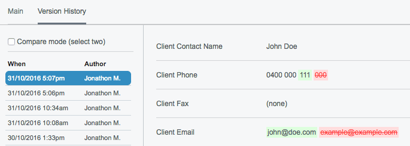

# Version History for SilverStripe CMS

This ports some of the functionality from the History tab of the page editing interface in SilverStripe and makes it available for other classes.



## Requirements

SilverStripe 3.1+ (3.4 tested)

## Installation

### Composer (best practice)

[Packagist listing](https://packagist.org/packages/jonom/silverstripe-version-history) and [installation instructions](http://doc.silverstripe.org/framework/en/trunk/installation/composer#adding-modules-to-your-project)

### Manually

I promise it's worth your time to learn how to use Composer. If painless updating isn't your thing though you can download and extract this project, rename the module folder 'version-history', place it in your project root and run a dev/build?flush=1.

## How to use

Just apply the `VersionHistoryExtension` extension to your class (which also has the Versioned extension) and a History tab will be added to the CMS fields.

```yml
MyClass:
  extensions:
    - Versioned("Stage")
    - VersionHistoryExtension
```

This module currently doesn't distinguish between staged and published versions, nor does it support rolling back to a previous version, because I'm using it simply to track changes. If you want to expand the functionality though, feel free to open a pull request!

### Hide some fields from the history tab

If you want to hide some fields from the history tab, you can set the `version_history_hidden_fields` configuration attribute on your DataObject. The following YML configuration applies the `VersionHistoryExtenion` to the `Member` DataObject, but hides sensitive information like the `Salt` and `Password` fields.

```yml
Member:
  extensions:
    - Versioned("Stage")
    - VersionHistoryExtension
  version_history_hidden_fields:
    - Password
    - PasswordEncryption
    - Salt
```

## Maintainer contact

[jonathonmenz.com](http://jonathonmenz.com)

## Tip jar

If this module helped you out and you want to say thanks, you're welcome to make a small donation or shout me a steam game.

[](https://www.paypal.com/cgi-bin/webscr?cmd=_s-xclick&hosted_button_id=Z5HEZREZSKA6A)
[](https://steamcommunity.com/profiles/76561198039777765/wishlist)
